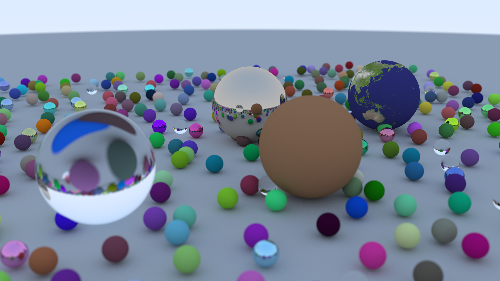

# `ray-tracing-in-one-weekend`

An implementation of [Ray Tracing in One Weekend](https://raytracing.github.io/) in Rust.

Extra features:
* Command-line interface
* Per-row parallelisation
* Bounding volume hierarchies
* Texture mapping